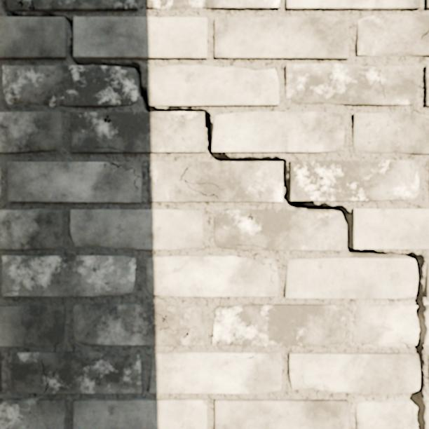
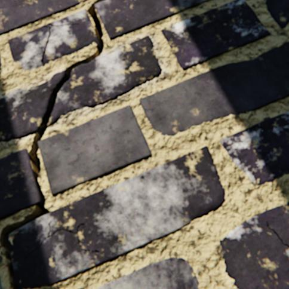

# BCG: synthetic masonry crack generation

Code for the Blender Crack Generation (BCG) framework: a synthetic data generation methodology
that produces cracked masonry scenes with automatic instance labels, together with the
experiments that measure how far such data reduce the real-annotation demand of masonry damage
segmentation.

The framework learns the empirical relationship between masonry layouts and crack locations
from real annotation masks, uses that relationship to guide a procedural crack-path sampler,
and renders the resulting scenes with 3D modelling software. Each rendered image is paired with
an automatically generated instance annotation for brick, broken brick and crack.

## Pipeline

```
MCrack1300 or another YOLO-seg masonry dataset (download separately)
       |
       v
01_crack_path_generation
   rasterise labels -> reconstruct masks -> train U-Net -> generate/refine wall and crack coordinates
       |
       v
02_blender_generation
   Dataset_Generator.blend + Asset_Library.blend + user-supplied HDRIs
       |
       +--------------------> six aligned RGB images + six colour masks per scene
       |
       +--------------------> optional YOLO polygon labels

03_prior_evaluation                 04_downstream_training
   learned prior vs uniform prior      real/synthetic/hybrid segmentation experiments
```

For copy-and-paste Windows terminal commands, start with [QUICKSTART.md](QUICKSTART.md).

## Directory guide

| Directory | Contents |
|---|---|
| `01_crack_path_generation/` | Mask preprocessing, procedural masonry layouts, the crack-probability U-Net and crack-path smoothing |
| `02_blender_generation/` | Blender scene construction, Boolean crack geometry, rendering, and label-to-polygon conversion |
| `03_prior_evaluation/` | Paired comparison of learned and uniform spatial priors, and the goal-bias and inertia grid |
| `04_downstream_training/` | Training protocols, selection scores and one complete acquisition-loop example |
| `05_datasets/` | Where to obtain the released BCG dataset |
| `docs/` | Illustrative figures used by the READMEs |

Each directory with non-obvious setup carries its own README.

## Examples

A small selection of RGB images generated by BCG. These examples show different masonry
materials, lighting conditions, crack geometries and camera distances.

<table>
  <tr>
    <td></td>
    <td></td>
    <td></td>
    <td></td>
    <td></td>
    <td></td>
  </tr>
</table>

## Data availability

The code and the generated data are released separately, so either can be downloaded on its
own.

| Item | Address |
|---|---|
| Code, this repository | [github.com/jianyu-blend/Blender-Crack-Generation-Code](https://github.com/jianyu-blend/Blender-Crack-Generation-Code) |
| BCG synthetic dataset | [github.com/jianyu-blend/Blender-Crack-Generation-Dataset](https://github.com/jianyu-blend/Blender-Crack-Generation-Dataset) |
| Downstream segmentation weights | Not released. One model-only checkpoint is approximately 140 MB for YOLOv8x-seg, 430 MB for Mask R-CNN X-101-FPN, or 270 MB for Mask2Former Swin-S. Checkpoints from several hundred runs would require tens of gigabytes; the training configurations and runnable example are provided instead. |

The dataset is released as its own repository, with its own description, checksums and
verification script. Nothing here has to be downloaded in order to use the dataset, and the
dataset is not needed to run the generator.

## Data

The reported results use [MCrack1300][mcrack-data], a published masonry instance-segmentation
dataset with 1000 training, 150 validation and 150 test images at 640 x 640 pixels. Its original
labels cover brick, broken brick, crack, spalling and plant; this work uses the three main
classes. **MCrack1300 is not included in this repository.** Download/export it separately from
Roboflow, then set `dataset_root` in `config.yaml` to the extracted YOLO-segmentation export.

[mcrack-data]: https://universe.roboflow.com/acsalab/masonry-zqhaw
  "MCrack1300/masonry instance-segmentation dataset on Roboflow"
[mcrack-paper]: https://doi.org/10.1016/j.aei.2024.102826
  "Ye, Lovell, Faramarzi and Ninic (2024), SAM-based instance segmentation models for the
  automation of structural damage detection, Advanced Engineering Informatics 62, 102826"

> Ye, Z., Lovell, L., Faramarzi, A. and Ninic, J. (2024). SAM-based instance segmentation
> models for the automation of structural damage detection. *Advanced Engineering Informatics*
> 62, 102826. [doi:10.1016/j.aei.2024.102826](https://doi.org/10.1016/j.aei.2024.102826) ·
> [arXiv:2401.15266](https://arxiv.org/abs/2401.15266)

Nothing in the code requires that dataset. Point `dataset_root` at any masonry export in YOLO
segmentation format with those three classes; the image counts are derived from the data.

The partitions are used as follows:

| Partition | Use |
|---|---|
| 1000 training images | 900 optimisation and 100 internal-validation images for the crack-probability U-Net, with seed 42. Nested subsets of 200, 400, 600, 800 and 1000 images for downstream training. |
| 150 validation images | Fixed downstream evaluation set and checkpoint selection, including the checkpoints that score the synthetic pool |
| 150 test images | Path-generation parameter grid and the learned-prior path comparison |

The external comparison uses [CSG2 v1](https://github.com/DavidHidde/cracked-surface-generation/tree/v1),
a published synthetic masonry-surface dataset whose binary
crack masks are converted to YOLO polygons by `02_blender_generation/masks_to_yolo_polygons.py`,
so that both synthetic sources are annotated by an identical procedure.

## Checkpoints

No trained weights are distributed with this release. Train the crack-probability U-Net with
`01_crack_path_generation/unet/`, which writes `<workspace_root>/runs/crack_unet/best.pt`,
selected by internal-validation loss. It supplies the learned maps for the path comparison and
guides crack generation for every BCG dataset in the downstream experiments.

The evaluation code reads the checkpoint through `unet_checkpoint` in `config.yaml`, which
defaults to `<workspace_root>/runs/crack_unet/best.pt`.

The downstream YOLOv8x-seg, Mask R-CNN and Mask2Former weights are not included. Depending on
framework serialization, one model-only checkpoint is approximately 140 MB for YOLOv8x-seg,
430 MB for Mask R-CNN X-101-FPN, or 270 MB for Mask2Former Swin-S; checkpoints that retain the
optimizer state are larger. Keeping the checkpoints from several hundred independent runs would
therefore add tens of gigabytes of binary files and make the repository impractical to clone.
The training protocols, configurations and runnable acquisition-loop example are included so
the required checkpoints can be reproduced.

## Setup

Nothing in this repository stores an absolute path. Copy the example
configuration, set the two required directories in it, and every script picks
them up:

    cp config.example.yaml config.yaml

| Entry | Meaning |
|---|---|
| `dataset_root` | An annotated masonry dataset in YOLO segmentation format, holding `train/`, `valid/` and `test/`, with classes 0 brick, 1 broken brick, 2 crack. Read only. |
| `workspace_root` | Where every derived mask, training run, evaluation and analysis output is written. The scripts create the subdirectories themselves. |

Check the result before running anything:

    python bcg_config.py

`BCG_CONFIG` points at a configuration file elsewhere, and `BCG_DATASET_ROOT`,
`BCG_WORKSPACE` and `BCG_UNET_CHECKPOINT` override individual entries, which is
convenient in a cluster job script. `config.yaml` is not tracked by git.

The workspace layout is fixed and needs no further configuration:

```
workspace_root/
  masks/train_reconstructed/   crack-free layouts rebuilt from the training masks
  masks/test_reconstructed/    the same reconstruction for the test partition
  masks/test_annotations/      the rasterised test annotations
  runs/crack_unet/             the crack-probability U-Net training run
  evaluation/                  the paired learned-prior path evaluation
  analysis/<name>/             every other analysis output
```

## Installation

    python -m venv .venv
    .venv/Scripts/activate        # Windows
    source .venv/bin/activate     # Linux and macOS
    pip install -r requirements.txt

The Blender stage runs inside Blender 4.5 LTS and needs none of these packages. Cycles
rendering with OptiX GPU acceleration was used for the reported production rates.

The repository includes `02_blender_generation/Dataset_Generator.blend` and
`02_blender_generation/Asset_Library.blend`. The `.exr` environment maps are excluded. Download
suitable equirectangular HDRIs from
[BlenderKit](https://www.blenderkit.com/asset-gallery?query=category_subtree%3Ahdr-outdoor)
or [Poly Haven](https://polyhaven.com/hdris), place them in one directory, and point
`hdri_directory` at it.

## Reproducing the main stages

Generate crack coordinates and render a batch of scenes:

    python 01_crack_path_generation/generate_crack_coordinates.py --walls 1 --paths-per-wall 1
    python 01_crack_path_generation/refine_crack_path.py <coordinate-directory>
    blender --background 02_blender_generation/Dataset_Generator.blend \
        --python 02_blender_generation/wall_generator.py -- \
        --config config.json
    python 02_blender_generation/masks_to_yolo_polygons.py --masks <renders> --output <labels>

Reproduce the learned-prior comparison and the eighteen-setting grid:

    cd 03_prior_evaluation
    python evaluate.py prepare
    python evaluate.py predict calibration
    python evaluate.py predict test
    python evaluate.py calibrate
    python evaluate.py evaluate
    python report.py

    python sweep_gamma_lambda.py --grid "0.3,0.7;0.3,0.8;0.3,0.9;0.5,0.7;0.5,0.8;0.5,0.9;0.7,0.7;0.7,0.8;0.7,0.9;0.9,0.7;0.9,0.8;0.9,0.9;1.1,0.7;1.1,0.8;1.1,0.9;1.3,0.7;1.3,0.8;1.3,0.9"
    python build_prior_ablation.py <per_image.csv> <summary.csv> <output.csv>

Run one downstream acquisition curve:

    python -u 04_downstream_training/example_yolo_active_learning.py

It reads `experiment_root` and `synthetic_pool` from the `downstream:` block of
`config.yaml`, so set those two before running it.

See `04_downstream_training/README.md` for the training protocols and the selection scores.
